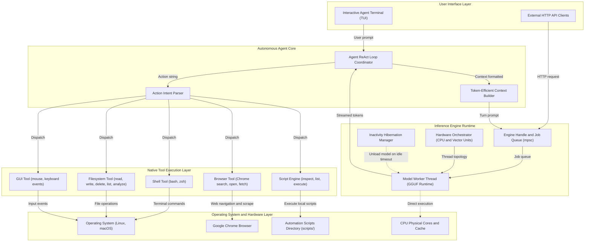

# ClawMind System Design and Architecture

## 1. Architectural Overview

ClawMind is structured as a decoupled, multi-threaded autonomous AI agent and local inference engine designed for hardware efficiency, predictable latency, and direct operating system control. The system consists of five primary subsystems:

1. Autonomous Agent and ReAct Loop (`agent/`): Coordinates user goals, maintains conversation context, parses structured model actions, and orchestrates multi-step tool executions through an interactive terminal interface (TUI).
2. Native Tool Execution Layer (`tools/`): Executes shell commands, filesystem operations, Google Chrome browser automation, client automation scripts (`Script-RAG`), and mouse/keyboard interactions directly in Rust.
3. Universal Hardware Orchestrator (`hardware.rs`): Identifies CPU topology, platform vector extensions (AVX2, AVX-512, NEON), memory capacity, and accelerator availability. Computes execution parameters dynamically.
4. Inference Engine Runtime (`engine.rs`): Manages the model lifecycle, KV-cache allocations, batching, and sampling within an isolated worker thread with automatic memory hibernation.
5. Asynchronous HTTP Gateway (`server.rs`): Axum-based non-blocking server providing OpenAI-compatible endpoints (`/v1/chat/completions`, `/v1/models`) and Ollama compatibility endpoints.



## 2. Autonomous Agent Architecture

### 2.1 ReAct Loop Implementation

The agent subsystem executes a multi-step Reason-Act (ReAct) cycle:

1. Goal Ingestion: The user inputs an objective through the terminal interface.
2. Context Construction: The system instructions, script metadata, and rolling conversation history are formatted using the model chat template.
3. Model Inference: Tokens stream in real time from the background inference worker.
4. Intent Detection: The parser extracts tool invocations from generated output:
   - Colon format: `Action: <tool_name>: <args>`
   - JSON format: `{"action": "<tool_name>", ...}`
   - Code block format: `Action: bash\n```bash\n<cmd>\n```
   - Completion format: `Action: done: <final response>`
5. Tool Execution: The tool registry routes the call to the corresponding native tool module.
6. Observation Feedback: Execution results are appended to the context as an observation turn.
7. Iteration: The cycle continues until completion is declared or the step limit is reached (default: 8 steps).

### 2.2 Token-Budget Prompt Optimization

To maintain low prefill latency on CPUs:
- System prompt is constrained to approximately 180 tokens with clear tool definitions and invocation syntax.
- Conversation history uses a rolling window bounding past turns to the last 8 interactions while preserving system guidelines.
- Prefill execution on modern desktop CPUs completes in under 1.0 second.

## 3. Tool Execution Layer

### 3.1 Shell Tool (`src/tools/shell.rs`)
- Platform-Aware Execution: Uses `/bin/bash -c` on Linux and `/bin/zsh -c` on macOS.
- State Persistence: Tracks working directory state across invocations, supporting `cd` commands transparently.
- Safety Timeout: Enforces a 30-second execution deadline using asynchronous Tokio timeouts.
- Output Management: Captures both stdout and stderr, truncating excessively long outputs (2000 characters maximum) to prevent memory blowout.

### 3.2 Filesystem Tool (`src/tools/fs.rs`)
- `file_write`: Creates or updates files, creating parent directory hierarchies automatically.
- `file_read`: Reads file contents with configurable line limits.
- `file_delete`: Removes target files or directories safely.
- `file_list`: Lists directory contents with item classification and file sizes in bytes.
- `file_analyze`: Inspects metadata, line count, word count, character count, and structural previews.

### 3.3 Browser Tool (`src/tools/browser.rs`)
- Automated Discovery: Locates Google Chrome across standard Linux paths and macOS application bundles.
- Visible Navigation (`browser_open`): Opens URLs in Google Chrome windows.
- Search Integration (`browser_search`): Constructs URL-encoded Google search queries.
- Headless Extraction (`browser_fetch`): High-speed HTTP retrieval and HTML tag-stripping to extract page text without GUI rendering overhead.

### 3.4 Script-RAG Engine (`src/tools/scripts.rs`)
- `script_list`: Discovers and indexes all client automation scripts in `scripts/`.
- `script_inspect`: Reads script source code, docstrings, parameter definitions, and usage notes.
- `script_run`: Executes automation scripts with parameters, working directory tracking, and timeout protection.

### 3.5 Mouse and Keyboard Tool (`src/tools/mouse.rs`)
- Linux Support: Interacts with desktop sessions using `xdotool` for pointer movements, clicks, text typing, and key presses.
- macOS Support: Interfaces with AppleScript System Events for native click, keystroke, and positioning events.

## 4. Hardware Orchestration and Inference Engine

### 4.1 Architecture-Aware Thread Steering
- Token Generation (Decode): Pinned to physical CPU cores to minimize L1/L2 cache contention and eliminate hyperthreading bottlenecks.
- Batch Evaluation (Prefill): Utilizes available logical threads for parallel matrix computation during prompt ingestion.

### 4.2 Inactivity Hibernation
- When idle for more than `idle_timeout_secs` (default: 300 seconds), model weights and context memory are unloaded from RAM.
- System RAM is reclaimed, dropping background CPU usage to 0.0% through passive OpenMP thread policies (`OMP_WAIT_POLICY=PASSIVE`).
- The worker thread automatically re-initializes upon the next incoming query.

## 5. Deployment and Orchestration

The system lifecycle is managed through `run.sh`:
- Automatic dependency verification (Rust toolchain, build essentials, Chrome, display utilities).
- Model weight verification and optional automated retrieval.
- Release compilation with compiler optimizations (`opt-level = 3`, `lto = fat`).
- Supports interactive agent mode, headless HTTP server mode, and benchmark mode.
